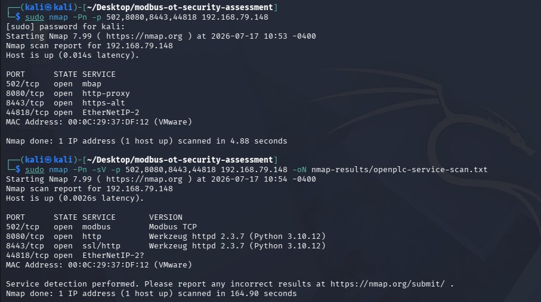
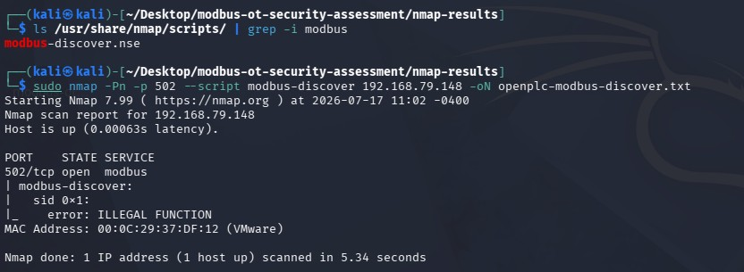
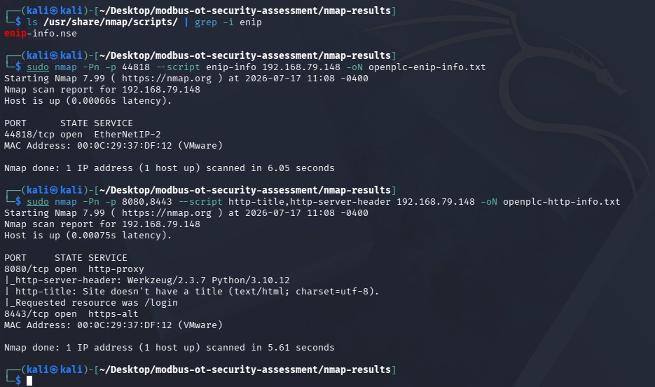

# Nmap Enumeration Summary

## Project Context

This section documents the Nmap-based enumeration performed against the Ubuntu/OpenPLC simulated PLC in the isolated virtual OT/ICS lab.

The purpose of this phase was to identify exposed services on the OpenPLC target, confirm whether Modbus/TCP was reachable, and collect basic service information that could support an OT/ICS security assessment.

## Lab Systems

| Role | System | IP Address |
|---|---|---|
| Simulated PLC / Target | Ubuntu with OpenPLC | `192.168.79.148` |
| Assessment Workstation | Kali Linux | `192.168.79.149` |

---

## Basic Port and Service Enumeration

### Objective

The first Nmap scan was used to identify whether key OpenPLC and OT-related ports were open on the simulated PLC.

### Command Used

```text
sudo nmap -Pn -p 502,8080,8443,44818 192.168.79.148
```

### Command Explanation

| Option | Meaning |
|---|---|
| `sudo` | Runs Nmap with elevated privileges |
| `nmap` | Network scanning tool |
| `-Pn` | Treats the host as online and skips host discovery |
| `-p 502,8080,8443,44818` | Scans only the selected ports |
| `192.168.79.148` | Target Ubuntu/OpenPLC VM |

### Ports Scanned

| Port | Purpose |
|---:|---|
| `502` | Modbus/TCP |
| `8080` | OpenPLC HTTP web interface |
| `8443` | OpenPLC HTTPS web interface |
| `44818` | EtherNet/IP related service |

### Result Summary

The scan identified the following open ports:

```text
502/tcp   open  mbap
8080/tcp  open  http-proxy
8443/tcp  open  https-alt
44818/tcp open  EtherNetIP-2
```

### Interpretation

The scan confirmed that the simulated PLC was reachable from Kali and had multiple services exposed. Most importantly, TCP port `502` was open, indicating that Modbus/TCP was accessible from the assessment workstation.



---

## Service Version Detection

### Objective

A second Nmap scan was run with service/version detection enabled. This was used to gather more detail about the services running on the target.

### Command Used

```text
sudo nmap -Pn -sV -p 502,8080,8443,44818 192.168.79.148 -oN nmap-results/openplc-service-scan.txt
```

### Command Explanation

| Option | Meaning |
|---|---|
| `-sV` | Enables service/version detection |
| `-oN` | Saves the output in normal text format |
| `nmap-results/openplc-service-scan.txt` | Output file for saved scan results |

### Result Summary

The service/version detection scan identified:

```text
502/tcp   open  modbus     Modbus TCP
8080/tcp  open  http       Werkzeug httpd 2.3.7 (Python 3.10.12)
8443/tcp  open  ssl/http   Werkzeug httpd 2.3.7 (Python 3.10.12)
44818/tcp open  EtherNetIP-2?
```

### Interpretation

This scan confirmed that port `502` was identified as **Modbus TCP**. It also showed that the OpenPLC web interface was running over HTTP/HTTPS using Werkzeug and Python.

The output was saved under:

```text
output-files/openplc-service-scan.txt
```


---

## Modbus-Specific Enumeration

### Objective

The `modbus-discover` NSE script was used to perform Modbus-specific enumeration against the OpenPLC target.

### Command Used

```text
sudo nmap -Pn -p 502 --script modbus-discover 192.168.79.148 -oN openplc-modbus-discover.txt
```

### Command Explanation

| Option | Meaning |
|---|---|
| `-p 502` | Scans only the Modbus/TCP port |
| `--script modbus-discover` | Runs the Modbus discovery NSE script |
| `-oN openplc-modbus-discover.txt` | Saves the script output |

### Result Summary

The scan returned:

```text
502/tcp open  modbus
| modbus-discover:
|   sid 0x1:
|_    error: ILLEGAL FUNCTION
```

### Interpretation

The scan confirmed that Modbus/TCP was reachable on port `502`. The script attempted to query Modbus device information using slave/unit ID `1`, but OpenPLC returned:

```text
ILLEGAL FUNCTION
```

This does not mean the scan failed. It means the simulated OpenPLC target responded to the Modbus request but did not support the specific function used by the script to retrieve device-identification information.

The output was saved under:

```text
output-files/openplc-modbus-discover.txt
```



---

## Additional Service Enumeration

### Objective

Because the Modbus discovery script did not return full device-identification details, additional Nmap scripts were used to collect information from other exposed services.

---

## EtherNet/IP Script Check

### Command Used

```text
ls /usr/share/nmap/scripts/ | grep -i enip
```

This confirmed that the `enip-info.nse` script was available.

### EtherNet/IP Enumeration Command

```text
sudo nmap -Pn -p 44818 --script enip-info 192.168.79.148 -oN openplc-enip-info.txt
```

### Result Summary

The scan confirmed that port `44818` was open:

```text
44818/tcp open  EtherNetIP-2
```

### Interpretation

The script confirmed that the EtherNet/IP-related service was reachable, but no additional device identity fields were returned by the simulated OpenPLC target.

The output was saved under:

```text
output-files/openplc-enip-info.txt
```



---

## HTTP Service Enumeration

### Command Used

```text
sudo nmap -Pn -p 8080,8443 --script http-title,http-server-header 192.168.79.148 -oN openplc-http-info.txt
```

### Result Summary

The scan returned:

```text
8080/tcp open  http-proxy
|_http-server-header: Werkzeug/2.3.7 Python/3.10.12
|_http-title: Site doesn't have a title (text/html; charset=utf-8).
|_Requested resource was /login
8443/tcp open  https-alt
```

### Interpretation

The HTTP enumeration confirmed that the OpenPLC web interface was reachable from Kali. It also identified the server header as:

```text
Werkzeug/2.3.7 Python/3.10.12
```

The result also showed that the requested web resource redirected to:

```text
/login
```

This confirmed that the OpenPLC login page was exposed on the network.

The output was saved under:

```text
output-files/openplc-http-info.txt
```


---

## Summary of Nmap Findings

| Finding | Evidence |
|---|---|
| OpenPLC target was reachable from Kali | Nmap completed successfully against `192.168.79.148` |
| Modbus/TCP was exposed | TCP port `502` open |
| Service detection identified Modbus | `502/tcp open modbus Modbus TCP` |
| OpenPLC web interface was exposed | Ports `8080` and `8443` open |
| HTTP server details were visible | Werkzeug/Python server header |
| EtherNet/IP-related service was exposed | TCP port `44818` open |
| Modbus device-identification request was unsupported | `ILLEGAL FUNCTION` response |

---

## Security Relevance

The Nmap enumeration showed that the simulated PLC exposed Modbus/TCP and management web services to the Kali assessment workstation. In a real OT/ICS environment, exposed PLC communication services should be carefully controlled because unauthorized access to industrial protocols may allow reading or modification of process-related values.

This enumeration phase also demonstrated why asset discovery and service validation are important during OT/ICS security assessments. Identifying open ports, exposed services, and protocol-specific behavior helps assess the attack surface and prioritize risk reduction.

---

## Defensive Considerations

Based on the enumeration results, the following controls would be relevant in a real OT/ICS environment:

- Restrict TCP port `502` access to approved engineering workstations or HMIs only.
- Avoid exposing PLC management interfaces to unnecessary network zones.
- Use network segmentation between IT, engineering, and control networks.
- Monitor for unauthorized scanning or service enumeration activity.
- Maintain an OT asset inventory with expected services and communication paths.
- Review firewall rules regularly to confirm only required industrial traffic is allowed.