# Lab Setup: OpenPLC Modbus/TCP Virtual OT/ICS Environment

## Objective

This section documents the setup process for the virtual OT/ICS lab used in this project.

The lab was created to simulate a small industrial control environment where OpenPLC acted as a simulated PLC and Kali Linux acted as the assessment workstation. The setup was used to safely perform Modbus/TCP enumeration, read testing, controlled write testing, and packet capture analysis.

All activities were performed in a controlled virtual lab environment.

---

## Lab Architecture

| Role | System | Purpose |
|---|---|---|
| Simulated PLC / Target | Ubuntu Desktop 22.04.5 with OpenPLC | Runs the PLC runtime and exposes Modbus/TCP |
| Assessment Workstation | Kali Linux | Performs Nmap enumeration, Metasploit Modbus testing, and Wireshark capture |

## Network Details

| System | IP Address |
|---|---|
| Ubuntu/OpenPLC VM | `192.168.79.148` |
| Kali Linux VM | `192.168.79.149` |

Both virtual machines were configured on the same virtual NAT network so that they could communicate with each other.

---

## Step 1: Verify Ubuntu IP Address and Connectivity with Kali

The Ubuntu VM was configured and assigned the IP address:

```text
192.168.79.148
```

Connectivity from Ubuntu to Kali was confirmed using `ping`.

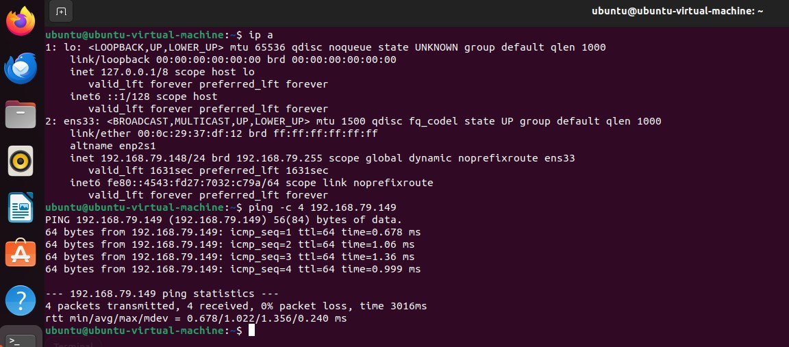

---

## Step 2: Verify Kali IP Address and Connectivity with Ubuntu

The Kali VM was assigned the IP address:

```text
192.168.79.149
```

Connectivity from Kali to Ubuntu was confirmed using `ping`.

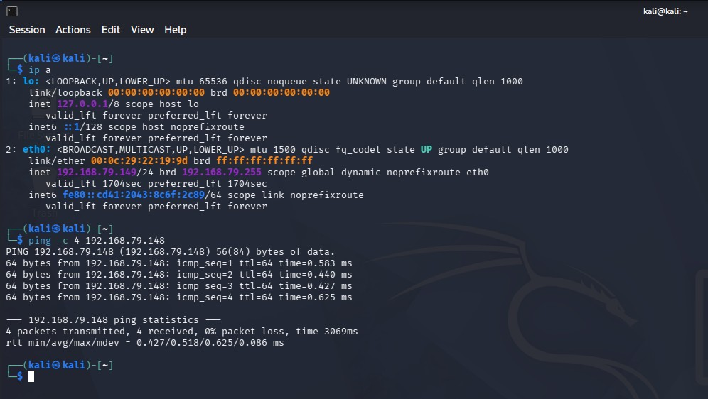

---

## Step 3: Install Basic Tools on Ubuntu

Before installing OpenPLC, basic tools were installed on Ubuntu.

Command used:

```bash
sudo apt install -y git curl net-tools
```

These tools were used for downloading OpenPLC, checking network configuration, and verifying installed utilities.

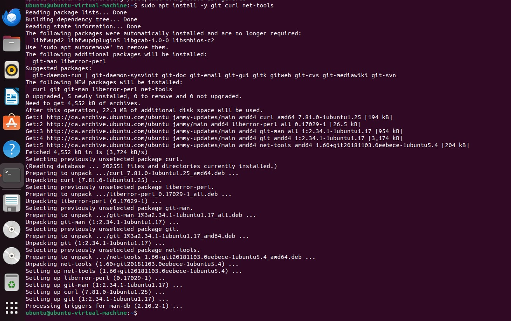

---

## Step 4: Verify Installed Tool Versions

The installed tools were verified using version commands.

Commands used:

```bash
git --version
curl --version
ifconfig --version
```

This confirmed that the required basic tools were available before continuing with OpenPLC installation.

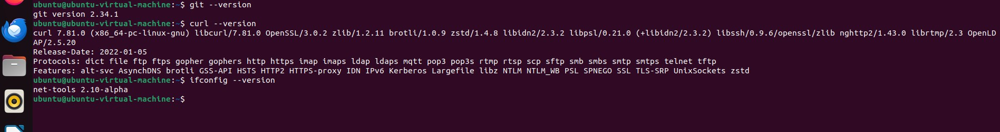

---

## Step 5: Install OpenPLC

OpenPLC was downloaded and installed on the Ubuntu VM.

Commands used:

```bash
cd ~
git clone https://github.com/thiagoralves/OpenPLC_v3.git
cd OpenPLC_v3
./install.sh linux
```

OpenPLC was used as the simulated PLC runtime for this lab.

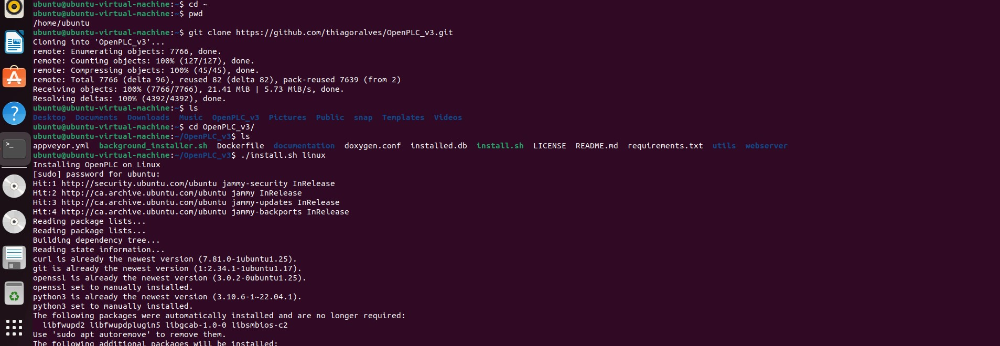

---

## Step 6: Start OpenPLC

After installation, OpenPLC was started from the `OpenPLC_v3` directory.

Command used:

```bash
cd ~/OpenPLC_v3
sudo ./start_openplc.sh
```

The OpenPLC webserver started successfully and listened on the web interface ports.


---

## Step 7: Access OpenPLC Web Interface

The OpenPLC web interface was accessed from the Ubuntu browser.

URL used:

```text
http://127.0.0.1:8080
```

Default credentials were used for the lab login:

```text
Username: openplc
Password: openplc
```

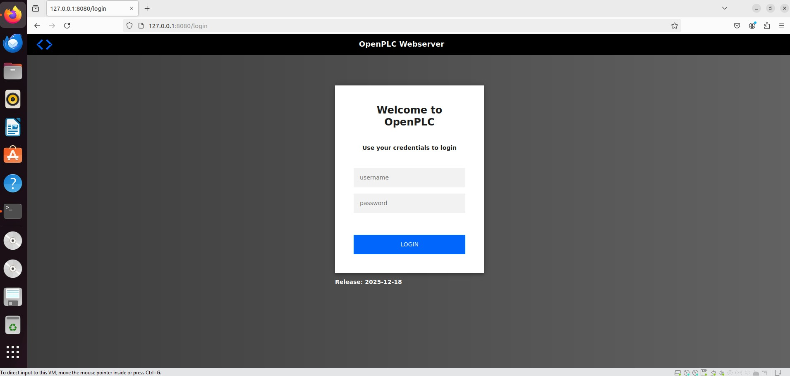

---

## Step 8: Confirm OpenPLC Dashboard Access

After login, the OpenPLC dashboard was accessible.

This confirmed that the OpenPLC web interface was functioning correctly.

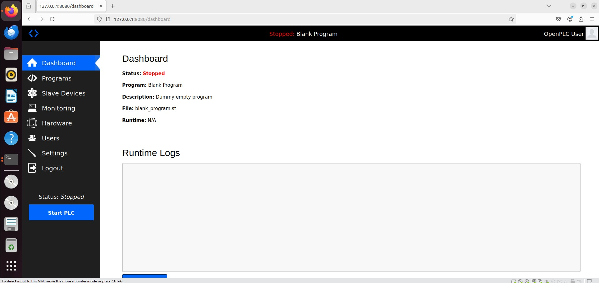

---

## Step 9: Create Sample Modbus Program

A simple Structured Text program was created for the lab.

The purpose of the program was to define simulated PLC variables that could be used for Modbus/TCP read and write testing.

Program file:

```text
modbus_lab.st
```

Program content:

```text
PROGRAM ModbusLab
  VAR_EXTERNAL
    Pump : BOOL;
    Valve : BOOL;
  END_VAR

  VAR
    DummyStatus : BOOL;
  END_VAR

  DummyStatus := Pump OR Valve;

END_PROGRAM

CONFIGURATION Config0
  VAR_GLOBAL
    Pump AT %QX0.0 : BOOL;
    Valve AT %QX0.1 : BOOL;
    TankLevel AT %MW0 : INT;
  END_VAR

  RESOURCE Res0 ON PLC
    TASK Main(INTERVAL := T#100ms, PRIORITY := 0);
    PROGRAM Inst0 WITH Main : ModbusLab;
  END_RESOURCE
END_CONFIGURATION
```

### Program Explanation

| Variable | Address | Type | Lab Meaning |
|---|---|---|---|
| `Pump` | `%QX0.0` | `BOOL` | Simulated pump output |
| `Valve` | `%QX0.1` | `BOOL` | Simulated valve output |
| `TankLevel` | `%MW0` | `INT` | Simulated tank-level register |

The `Pump` and `Valve` variables were mapped as Boolean output values, while `TankLevel` was mapped to memory word `%MW0`. In this project, `%MW0` was used as holding register address `0` during the Modbus read/write tests.

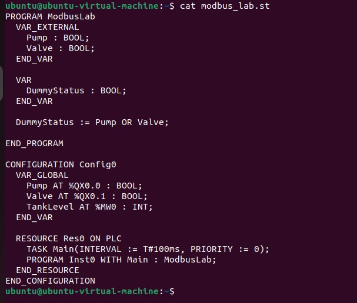

---

## Step 10: Upload Program to OpenPLC

The sample Modbus program was uploaded through the OpenPLC web interface.

Program name used:

```text
modbus_lab
```

The file uploaded was:

```text
modbus_lab.st
```

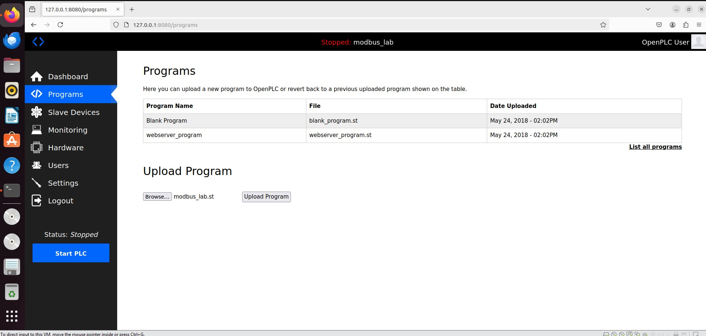

---

## Step 11: Confirm Program Compilation

After upload, OpenPLC compiled the program successfully.

The successful compilation confirmed that the Structured Text program was valid and ready to run in the OpenPLC runtime.

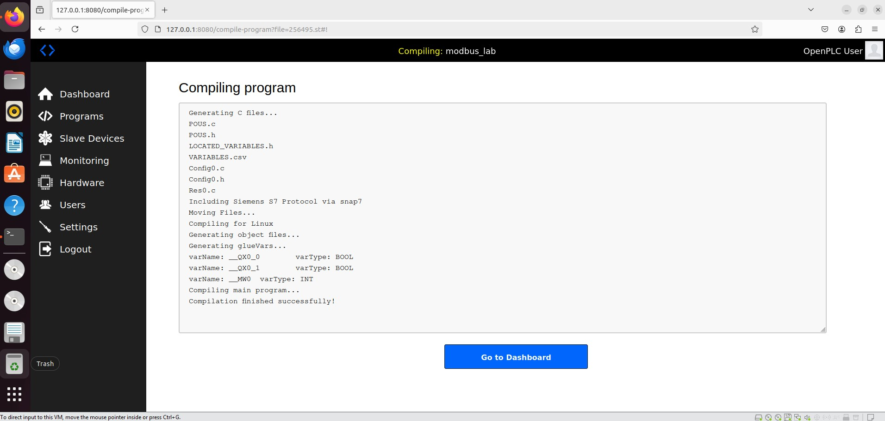

---

## Step 12: Start PLC Runtime from Dashboard

After successful compilation, the PLC runtime was started from the OpenPLC dashboard using the **Start PLC** button.

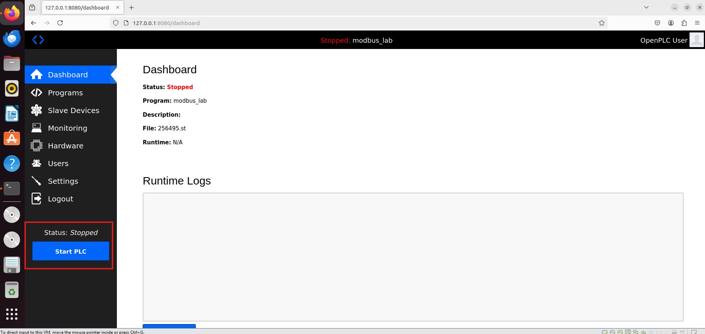

---

## Step 13: Confirm PLC Status is Running

The OpenPLC dashboard showed the PLC runtime status as:

```text
Running
```

This confirmed that the `modbus_lab` program was running.

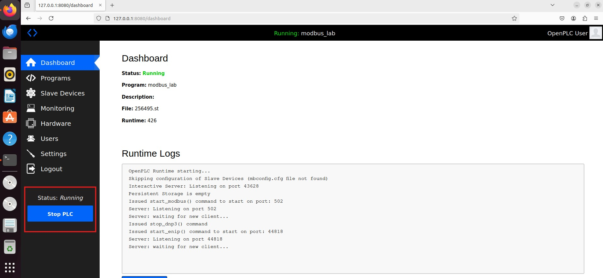

---

## Step 14: Verify Modbus/TCP is Listening

The Modbus/TCP service was verified from the Ubuntu terminal.

Command used:

```bash
sudo ss -tulpn | grep -E '8080|8443|502'
```

The output confirmed that OpenPLC was listening on:

```text
8080/tcp  OpenPLC web interface
8443/tcp  OpenPLC HTTPS interface
502/tcp   Modbus/TCP
```

The key confirmation was:

```text
0.0.0.0:502
```

This showed that Modbus/TCP was active and reachable on port `502`.

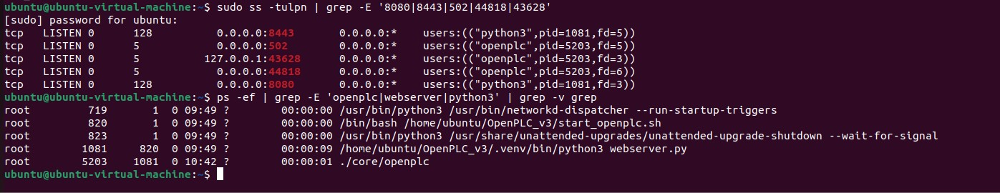

---

## Lab Readiness

The next steps performed in the project were:

1. Nmap enumeration of the OpenPLC target.
2. Modbus-specific discovery.
3. Metasploit Modbus read testing.
4. Controlled Modbus write testing.
5. Wireshark packet capture and analysis.
6. OT/ICS risk assessment.
