# Wireshark Modbus/TCP Traffic Analysis

## Project Context

This section documents the Modbus/TCP traffic captured during the controlled read and write tests between the Kali assessment workstation and the Ubuntu/OpenPLC simulated PLC.

Wireshark was used on the Kali VM to capture the traffic generated by Metasploit. The purpose was to confirm the Modbus/TCP activity at the packet level and validate that the read and write operations were visible on the network.

## Lab Systems

| Role | System | IP Address |
|---|---|---|
| Simulated PLC / Target | Ubuntu with OpenPLC | `192.168.79.148` |
| Assessment Workstation | Kali Linux | `192.168.79.149` |

## Capture and Display Filter

Wireshark was run on the Kali assessment workstation. The traffic was filtered to show communication involving the OpenPLC target and Modbus/TCP port `502`.

Display filter used:

```text
ip.addr == 192.168.79.148 && tcp.port == 502
```

This filter displayed traffic where the OpenPLC VM was involved and where TCP port `502` was used.

TCP port `502` is commonly used for Modbus/TCP communication.

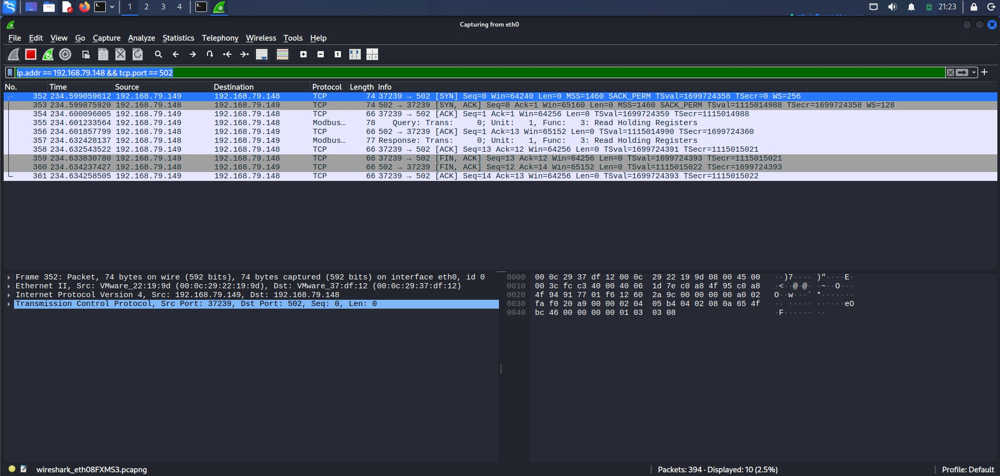

---

## Modbus Read Operation

### Objective

The first Wireshark capture focused on the Modbus read operation generated from Metasploit.

The Metasploit action used was:

```text
READ_HOLDING_REGISTERS
```

The goal was to read holding register address `0`, which was mapped in OpenPLC to the simulated `TankLevel` variable.

## Read Operation Generated from Metasploit

The following Metasploit operation generated the Modbus read traffic:

```text
set ACTION READ_HOLDING_REGISTERS
set DATA_ADDRESS 0
set NUMBER 1
run
```

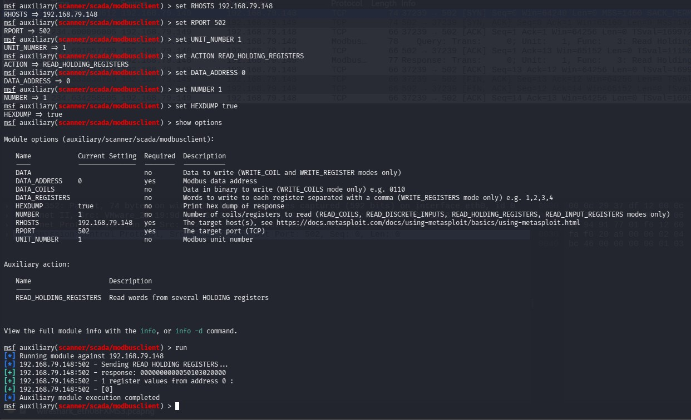

---

## Modbus Read Request

### Packet Direction

```text
Source: 192.168.79.149
Destination: 192.168.79.148
```

This shows Kali sending a Modbus request to the Ubuntu/OpenPLC target.

### Packet Details

The Wireshark packet details showed:

```text
Protocol: Modbus/TCP
Unit Identifier: 1
Function Code: 3 - Read Holding Registers
Reference Number: 0
Word Count: 1
```

### Interpretation

This packet shows that Kali requested one holding register value from OpenPLC, starting at register address `0`.

In this lab, holding register address `0` represented the simulated `TankLevel` value.

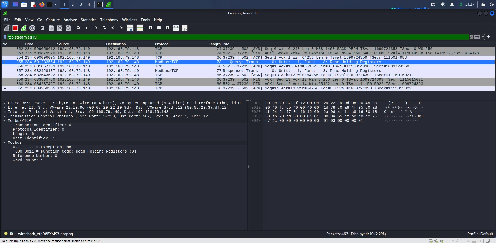

---

## Modbus Read Response

### Packet Direction

```text
Source: 192.168.79.148
Destination: 192.168.79.149
```

This shows OpenPLC responding back to Kali.

### Packet Details

The Wireshark packet details showed:

```text
Protocol: Modbus/TCP
Unit Identifier: 1
Function Code: 3 - Read Holding Registers
Register Number: 0
Register Value: 0
```

### Interpretation

The response confirmed that OpenPLC returned the value of holding register address `0`.

The value returned was:

```text
0
```

This matched the Metasploit result and confirmed that the register initially contained value `0`.

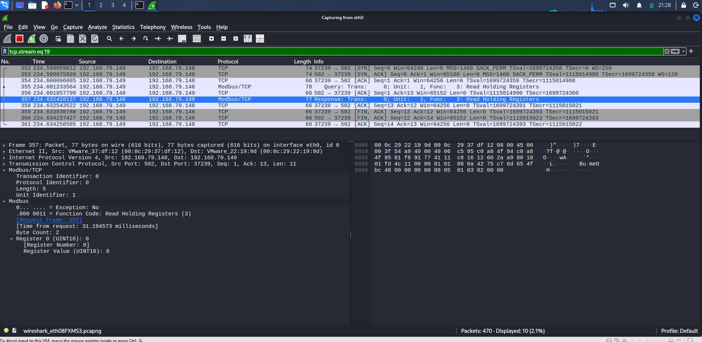

---

## Modbus Write Operation

### Objective

The second Wireshark capture focused on the controlled Modbus write operation generated from Metasploit.

The Metasploit action used was:

```text
WRITE_REGISTER
```

The goal was to write the value `75` to holding register address `0`.

In the lab scenario, this represented changing the simulated `TankLevel` value from `0` to `75`.

## Write Operation Generated from Metasploit

The following Metasploit operation generated the Modbus write traffic:

```text
set ACTION WRITE_REGISTER
set DATA_ADDRESS 0
set DATA 75
run
```

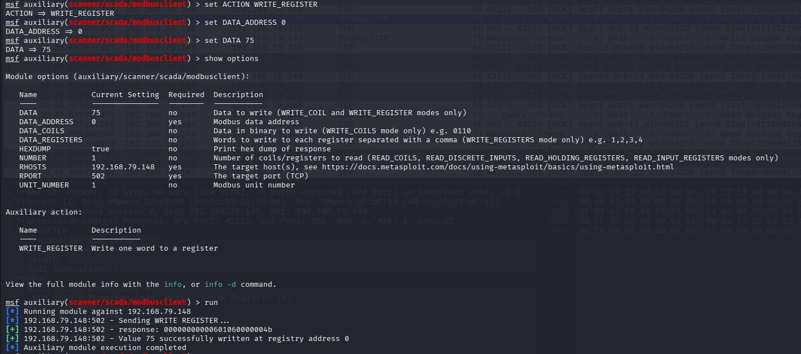

The write traffic was then visible in Wireshark.

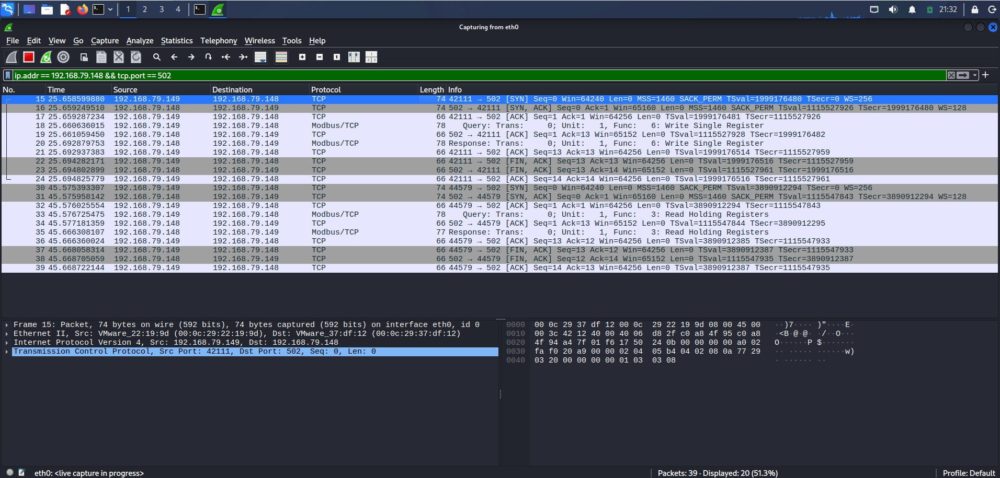

---

## Modbus Write Request

### Packet Direction

```text
Source: 192.168.79.149
Destination: 192.168.79.148
```

This shows Kali sending a Modbus write request to OpenPLC.

### Packet Details

The Wireshark packet details showed:

```text
Protocol: Modbus/TCP
Unit Identifier: 1
Function Code: 6 - Write Single Register
Reference Number: 0
Register Value: 75
```

### Interpretation

This packet confirms that Kali sent a Modbus `Write Single Register` request to OpenPLC.

The request targeted:

```text
Register Address: 0
Register Value: 75
```

This means the Kali assessment workstation attempted to write the value `75` to holding register address `0`.

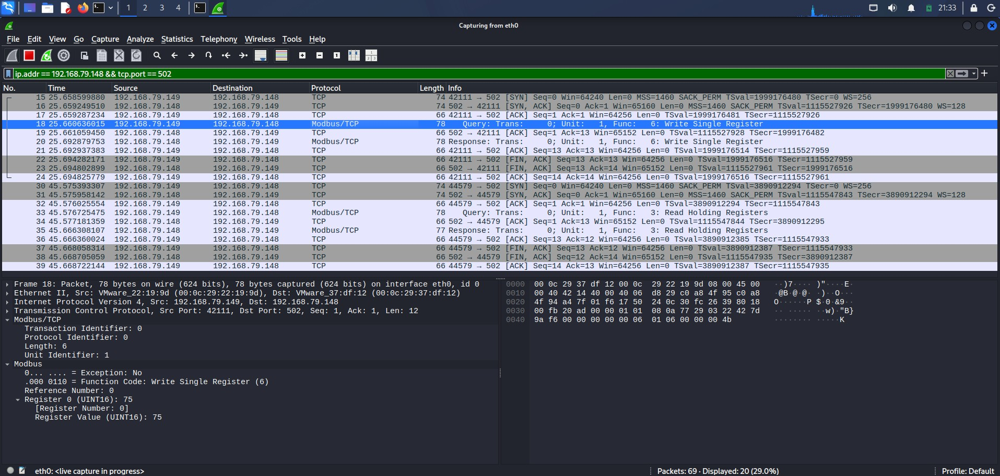

---

## Modbus Write Response

### Packet Direction

```text
Source: 192.168.79.148
Destination: 192.168.79.149
```

This shows OpenPLC responding back to Kali.

### Packet Details

The Wireshark packet details showed:

```text
Protocol: Modbus/TCP
Unit Identifier: 1
Function Code: 6 - Write Single Register
Reference Number: 0
Register Value: 75
```

### Interpretation

For Modbus function code `6`, the response normally echoes the register address and value back to the client.

The response confirmed that OpenPLC accepted the write request for register address `0` with value `75`.

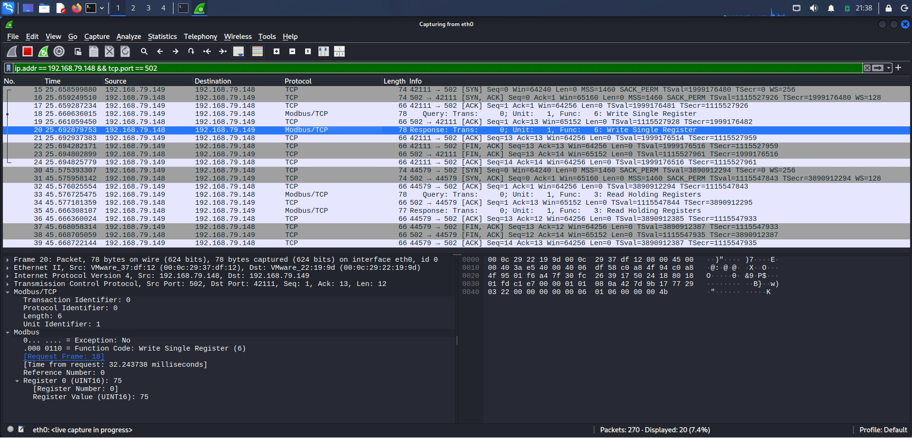

---

## Read-Back Verification After Write

### Objective

After writing the value `75`, a read-back operation was performed to verify that the register value actually changed.

The Metasploit action used was:

```text
READ_HOLDING_REGISTERS
```

## Read-Back Operation Generated from Metasploit

The following Metasploit operation generated the read-back traffic:

```text
set ACTION READ_HOLDING_REGISTERS
set DATA_ADDRESS 0
set NUMBER 1
run
```

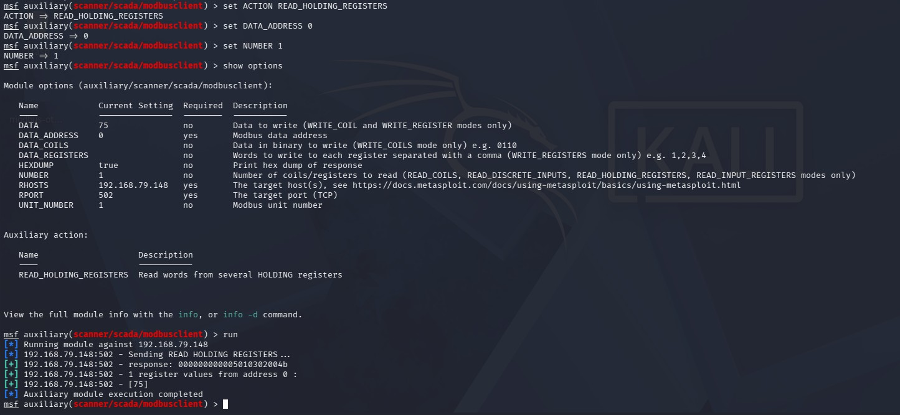

---

## Modbus Read-Back Request

### Packet Direction

```text
Source: 192.168.79.149
Destination: 192.168.79.148
```

This shows Kali sending another read request to OpenPLC after the write operation.

### Packet Details

The Wireshark packet details showed:

```text
Protocol: Modbus/TCP
Unit Identifier: 1
Function Code: 3 - Read Holding Registers
Reference Number: 0
Word Count: 1
```

### Interpretation

This packet shows that Kali requested the value of holding register address `0` again after the write operation.

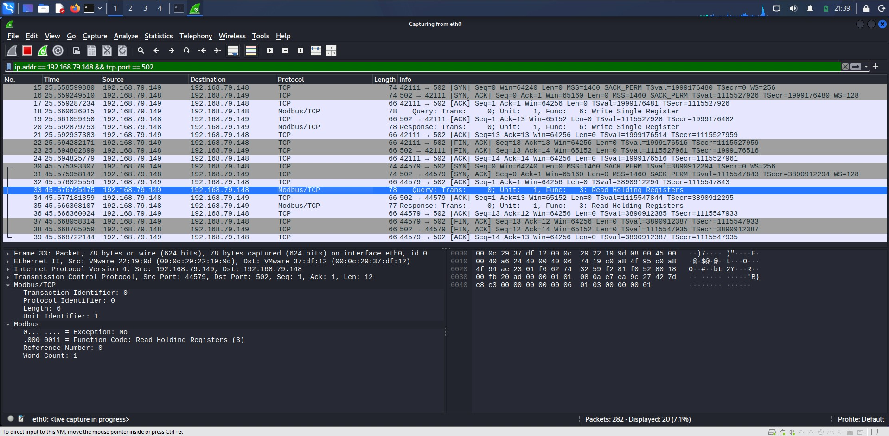

---

## Modbus Read-Back Response

### Packet Direction

```text
Source: 192.168.79.148
Destination: 192.168.79.149
```

This shows OpenPLC responding with the updated register value.

### Packet Details

The Wireshark packet details showed:

```text
Protocol: Modbus/TCP
Unit Identifier: 1
Function Code: 3 - Read Holding Registers
Register Number: 0
Register Value: 75
```

### Interpretation

The response confirmed that holding register address `0` contained the updated value:

```text
75
```

This matched the Metasploit read-back result and confirmed at the packet level that the Modbus write operation changed the register value.

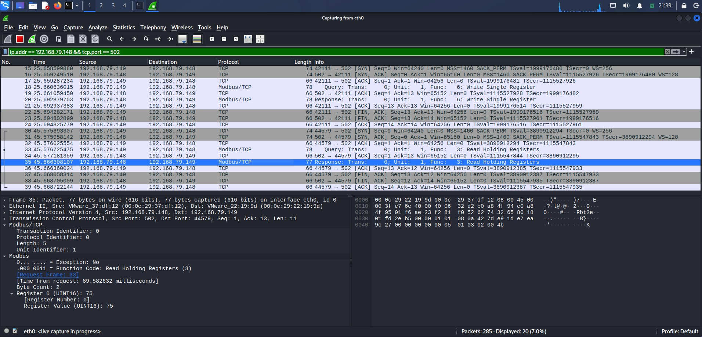

---

## PCAP Files

The following packet capture files were saved for evidence:

```text
pcaps/modbus-read-traffic.pcapng
pcaps/modbus-write-traffic.pcapng
```

| PCAP File | Description |
|---|---|
| `pcaps/modbus-read-traffic.pcapng` | Contains the Modbus/TCP read operation traffic |
| `pcaps/modbus-write-traffic.pcapng` | Contains the Modbus/TCP write operation and read-back verification traffic |

## Summary of Observed Modbus Function Codes

| Function Code | Name | Observed Activity |
|---:|---|---|
| `3` | Read Holding Registers | Kali read holding register address `0` |
| `6` | Write Single Register | Kali wrote value `75` to holding register address `0` |

## Key Finding

Wireshark confirmed that the Kali assessment workstation communicated with the OpenPLC simulated PLC over Modbus/TCP. The capture showed both read and write operations. Most importantly, the write capture showed function code `6`, Write Single Register, where Kali wrote value `75` to holding register address `0`.

## Security Relevance

This traffic demonstrates why direct access to Modbus/TCP services should be restricted in OT/ICS environments. If an unauthorized workstation can reach a PLC over TCP port `502`, it may be able to read or modify process-related values.

In a real environment, unauthorized modification of PLC registers could affect process visibility, equipment behavior, reliability, or safety depending on what the register controls or represents.

## Defensive Considerations

Based on this lab activity, useful defensive controls would include:

- Restricting access to TCP port `502` to approved engineering workstations or HMIs only.
- Segmenting OT networks from general IT or user networks.
- Monitoring for Modbus write function codes, especially function code `6`.
- Alerting when a new or unauthorized host communicates with PLC assets.
- Maintaining an approved asset inventory and expected communication baseline.
- Reviewing firewall and access-control rules regularly.
